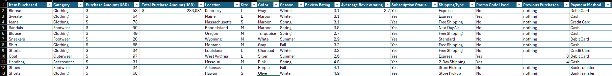
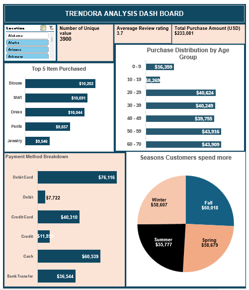

## Trendora Analysis

## Executive Summary
This Excel-based analysis provides a comprehensive overview of Trendora’s performance, highlighting key financial, operational, and market indicators. The dataset was analyzed to identify trends, measure growth, and evaluate efficiency across core metrics.

## Business Context
Trendora operates in a competitive market environment where data-driven decision-making is essential for growth and sustainability. The purpose of this analysis is to evaluate Trendora’s key business metrics — including sales performance, operational efficiency, and market trends — to identify strengths, weaknesses, and opportunities for improvement.
By leveraging Excel for data visualization and trend analysis, this report aims to provide a clear understanding of Trendora’s current position and guide strategic actions that enhance profitability, optimize resources, and support long-term business objectives.

## Objective
- To analyze key business data and identify performance trends over time.
- To evaluate sales, revenue, and operational efficiency using Excel tools.
- To uncover insights that support strategic decision-making and planning.
- To visualize data through charts and dashboards for easier interpretation.
- To identify areas of improvement and opportunities for business growth.

## Data Overview
The dataset consists of 3,900 purchase records with 16 columns, covering customer details (age, gender, location), purchase information (items, quantity, amount, season, date), transaction details (payment method, store type), and feedback metrics (review ratings, return status).

## Data Preview

## Key Findings
- Total purchase amount is approximately $233,000
- The analysis reveals that the top five purchased items are blouses, shirts, dresses, pants, and jewelry, respectively.
- The analysis indicates that customers spend the most during the Fall season.
- Customers in the 60–70 age group account for the highest number of purchases.

## DashBoard

